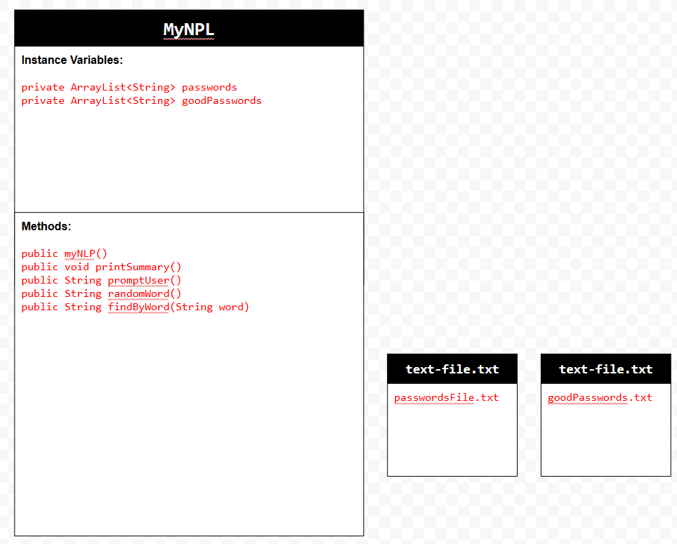

# Unit 6 - Natural Language Processing Project

## Introduction

Natural language processing (NLP) is used in many apps and devices to interact with users and make meaning of text to determine how to respond, find information, or to create new text. Your goal is to use natural language processing techniques to identify structure, patterns, and meaning in a text to have conversations with a user, execute commands, perform manipulations on the text, or generate new text.

## Requirements

Use your knowledge of object-oriented programming, ArrayLists, the String class, and algorithms to create a program that uses natural language processing techniques:

- **Create at least two ArrayLists** – Create at least two ArrayLists to store the data used in your program, such as data from text files or entered by the user.
- **Implement one or more algorithms** – Implement one or more algorithms that use loops and conditionals to find or manipulate elements in an ArrayList or String object.
- **Use methods in the String classs** - Use one or more methods in the String class in your program, such as to divide text into sentences or phrases.
- **Use at least one natural language processing technique** – Use a natural language processing technique to process, analyze, and/or generate text.
- **Document your code** – Use comments to explain the purpose of the methods and code segments and note any preconditions and postconditions.

## UML Diagram

Put and image of your UML Diagram here. Upload the image of your UML Diagram to your repository, then use the Markdown syntax to insert your image here. Make sure your image file name is one word, otherwise it might not properly get display on this README.

## Video

Record a short video of your project to display here on your README. You can do this by:

- Screen record your project running on Code.org.
- Upload that recording to YouTube.
- Take a thumbnail for your image.
- Upload the thumbnail image to your repo.
- Use the following markdown code:

## Project Description

Write a description of the goal and/or problem that your application. Include descriptions of what text is being analyzed, either if its text files you are using to interpret text an how the user interacts with your project.

The goal that my application is trying to solve is the security and safety of the password the user wants to use. We want to make sure that the password they are using is not going to be easy to guess. The text that is being analyzed is the password the user wishes to use. It goes over an arraylist of many easy passwords you can guess, and checks to see if the password they want is similar to that. If it is, they will get a better and stronger password, and if not, they will be told it is ok. This is an important in modern day apps since computers are programmed to guess passwords instantly. 

## NLP Techniques

Write a description of what natural lanugage technique (NLP) you implemented in your project. State which methods in your project are associated with this, and a brief explanation of how those methods word and how they are necessary in the NLP technique. 

Some natural language processing techniques that I implemented in my project is the .get method which gets the index in the passwords.size() and goodPasswords.size(). This helps check to see if the password they want is secure and safe for a login. 